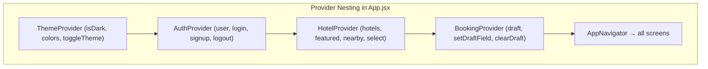
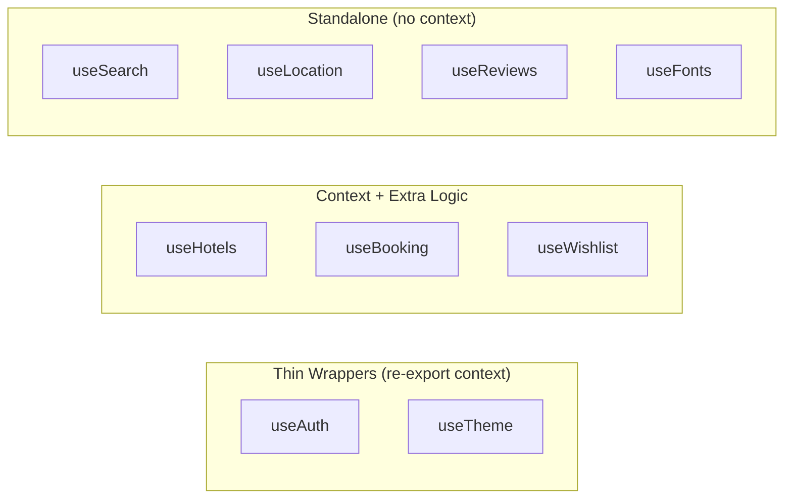
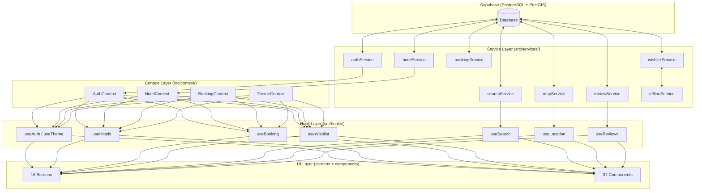

# GrandStay — Architecture Deep-Dive

## 1. Contexts: What They Are & How They're Used

React **Context** is a dependency-injection mechanism. It lets you place a value at the top of a component tree and read it from any descendant without manually passing props through every level (a.k.a. "prop drilling").

### The Three Pieces of a Context

| Piece | Role |
|---|---|
| `createContext(null)` | Creates a "channel" — an empty container |
| `<Context.Provider value={…}>` | **Writes** a value into that channel for the subtree |
| `useContext(Context)` | **Reads** the current value from the nearest Provider above |

### GrandStay's 4 Contexts



#### 1. ThemeContext — [ThemeContext.jsx](file:///Users/atharvapramodjadhav/Documents/GrandStay-App/src/context/ThemeContext.jsx)

**Manages:** Light/dark mode toggle with AsyncStorage persistence.

**State:** `isDark` boolean.
**Derived:** `theme` (full color palette from `lightTheme` / `darkTheme`), `colors` shortcut.
**Actions:** `toggleTheme()`, `setDarkMode(bool)`.

```jsx
// On mount, reads saved preference
AsyncStorage.getItem('@grandstay_theme') → setIsDark(parsed)

// On toggle, writes back
AsyncStorage.setItem('@grandstay_theme', JSON.stringify(newValue))
```

**Why it's outermost:** Theme colors are needed everywhere — including the auth screens. It has no dependency on any other context.

---

#### 2. AuthContext — [AuthContext.jsx](file:///Users/atharvapramodjadhav/Documents/GrandStay-App/src/context/AuthContext.jsx)

**Manages:** User authentication state via Supabase Auth.

**State:** `user` (profile object or null), `loading`.
**Derived:** `isAuthenticated` (`!!user`).
**Actions:** `login()`, `signup()`, `logout()`, `updateUser()`.

**Key mechanism — the auth state listener:**
```jsx
// Sets up dual initialization:
// 1. Immediate session check
supabase.auth.getSession() → fetchAndSetProfile(session.user)

// 2. Ongoing listener for auth changes (login/logout/token refresh)
supabase.auth.onAuthStateChange((_event, session) => { ... })
```

The listener fires whenever Supabase detects a session change (login, logout, token refresh). This means the context is always in sync with the actual auth state — screens never need to manually call "refresh auth."

**Why it's 2nd:** It doesn't need hotel or booking state, but everything below it needs to know who is logged in.

---

#### 3. HotelContext — [HotelContext.jsx](file:///Users/atharvapramodjadhav/Documents/GrandStay-App/src/context/HotelContext.jsx)

**Manages:** Global hotel data — lists + currently selected hotel.

**State:** `hotels`, `featuredHotels`, `nearbyHotels`, `selectedHotel`, `loading`, `error`.
**Actions:** `loadHotels()`, `loadFeatured()`, `loadNearby(lat, lng, radius)`, `setSelectedHotel()`, `clearSelectedHotel()`.

**Why it's 3rd:** Hotels don't depend on bookings, but bookings need to reference which hotel/room is being booked.

---

#### 4. BookingContext — [BookingContext.jsx](file:///Users/atharvapramodjadhav/Documents/GrandStay-App/src/context/BookingContext.jsx)

**Manages:** A progressive "draft" object that accumulates data as the user walks through the 5-step booking flow.

```
Hotel → Room → Dates/Guests → Guest Details → Payment
```

**State:** A single `draft` object with ~15 fields.
**Actions:** `setDraftField(key, val)`, `setHotelInfo(hotel)`, `setRoomInfo(room)`, `setGuests(obj)`, `setPriceBreakdown(obj)`, `clearDraft()`, `calculateTotal()`.

**Why it's innermost:** It's only needed inside the main app (never on the auth screens), and it conceptually depends on hotel data to populate hotel/room fields.

---

## 2. Hooks: What They Are & How They're Used

**Custom hooks** are functions (prefixed `use`) that compose React's built-in hooks (`useState`, `useEffect`, `useCallback`, `useRef`, `useContext`) into reusable units of behavior.

### GrandStay's Hook Architecture — 3 Categories



### Category 1: Thin Wrappers

**`useAuth`** and **`useTheme`** are one-liners that simply re-export the context hook:

```jsx
// useAuth.js
export const useAuth = () => useAuthContext();

// useTheme.js
export const useTheme = () => useThemeContext();
```

**Purpose:** Decouples component imports from the context file. Screens import `useAuth` instead of `useAuthContext` — if you later swap to Zustand, you only change the hook file, not 20 screens.

### Category 2: Context + Extra Logic

| Hook | Context Used | Added Behavior |
|---|---|---|
| [useHotels](file:///Users/atharvapramodjadhav/Documents/GrandStay-App/src/hooks/useHotels.js) | `HotelContext` | Adds `fetchHotel(id)` and `fetchRooms(id)` — per-entity fetches not in the context. Merges its own `loading`/`error` with context's |
| [useBooking](file:///Users/atharvapramodjadhav/Documents/GrandStay-App/src/hooks/useBooking.js) | `BookingContext` | Adds `updatePrice()` that calls `bookingService.calculatePrice` and writes the result back into the context's draft |
| [useWishlist](file:///Users/atharvapramodjadhav/Documents/GrandStay-App/src/hooks/useWishlist.js) | `AuthContext` (for `user.uid`) | Manages its own `wishlist[]` state, calls `wishlistService`. Provides `toggleWishlist(hotel)` with optimistic local array updates |

**Key pattern — `useHotels` merges loading states:**
```jsx
return {
  ...context,            // spread all of HotelContext
  fetchHotel,            // add extra methods
  fetchRooms,
  loading: context.loading || loading,  // merged
  error: context.error || error,        // merged
};
```

### Category 3: Standalone Hooks (No Context)

| Hook | What It Manages |
|---|---|
| [useSearch](file:///Users/atharvapramodjadhav/Documents/GrandStay-App/src/hooks/useSearch.js) | Local `query`, `results`, `filters` state. Implements 300ms debounced search via `useRef` timer. Calls `searchService` directly |
| [useLocation](file:///Users/atharvapramodjadhav/Documents/GrandStay-App/src/hooks/useLocation.js) | GPS coordinates via `expo-location`. Handles permission denial with fallback to a default city region |
| [useReviews](file:///Users/atharvapramodjadhav/Documents/GrandStay-App/src/hooks/useReviews.js) | Per-hotel reviews. Takes `hotelId` as parameter — fetches and exposes `reviews[]`, `addReview()` |
| useFonts | Loads Inter font family variants |

---

## 3. Full Data Flow Diagram



**The strict rule:** Screens/Components → Hooks → Context/Services → Supabase. No screen ever imports `supabase` directly.

---

## 4. Architectural Tradeoffs

### What Works Well ✅

| Decision | Benefit |
|---|---|
| **Service layer isolation** | Backend is fully swappable. Screens are backend-agnostic. The `seedFirestore.js` remnant proves this — they migrated from Firebase without touching UI code |
| **Hook abstraction over contexts** | Components import `useAuth()` not `useAuthContext()`. Swap to Zustand/Redux later with zero screen changes |
| **PostGIS server-side spatial queries** | O(log n) indexed queries vs. O(n) client-side filtering. Critical when hotel count grows beyond thousands |
| **Optimistic cache-first wishlist** | Instant UI updates. Offline writes queued and retried. Production-grade UX pattern |
| **Design token system** | `constants.js` → `theme.js` → all components. One file change = app-wide visual update |
| **BookingContext as progressive draft** | Eliminates prop drilling across 5 booking screens. Natural fit for wizard/stepper flows |

### What Could Be Problematic ⚠️

| Issue | Impact | Severity |
|---|---|---|
| **No `useMemo` on context `value` objects** | Every context creates a **new object literal** on each render (e.g., `value={{ user, loading, login, ... }}`). This causes **all consumers** of that context to re-render even when the actual data hasn't changed | **High** |
| **HotelContext is global but holds UI-specific state** | `selectedHotel` is navigation-specific state stored globally. Navigating between screens can cause stale selections or conflicts | Medium |
| **Wishlist is hook-local, not in context** | Every component using `useWishlist()` creates **its own copy** of the wishlist array. Two `HotelCard` instances with wishlist toggles won't share state | **High** |
| **`useSearch` is fully local** | Search state is lost on unmount. Navigating away from results and back forces a re-search | Medium |
| **No loading/error boundaries per context** | `AuthContext` loading blocks the entire app. There's no granular skeleton/error UI per data domain | Medium |
| **BookingContext draft lives forever** | The draft persists in memory even after booking completes. `clearDraft()` must be called manually — a missed call = stale data on next booking | Low-Medium |
| **Silent error swallowing** | `ThemeContext`, `useWishlist`, `loadFeatured` all silently catch and ignore errors. Debugging production issues becomes very difficult | Medium |

---

## 5. What Could Be Better — Architecture Recommendations

### 1. Memoize Context Values

> [!CAUTION]
> This is the single highest-impact improvement. Without it, the app re-renders far more than necessary.

```diff
// Current — new object every render
  return (
-   <AuthContext.Provider value={{ user, loading, login, ... }}>
+   <AuthContext.Provider value={useMemo(() => ({
+     user, loading, isAuthenticated: !!user, login, signup, logout, updateUser, setUser
+   }), [user, loading, login, signup, logout, updateUser])}>
```

### 2. Promote Wishlist to a Context (or Use a State Library)

Since wishlist is shared across `HotelCard`, `HotelDetailsScreen`, and `WishlistScreen`, it needs a **single source of truth:**

```
WishlistContext (or Zustand store)
  ├── wishlistIds: Set<string>
  ├── toggle(hotelId)
  └── isInWishlist(hotelId) → boolean
```

### 3. Replace `selectedHotel` with Navigation Params

Instead of storing the selected hotel in global context:

```jsx
// Better: pass via navigation
navigation.navigate('HotelDetails', { hotelId: hotel.id });

// Then in HotelDetailsScreen:
const { hotelId } = route.params;
const hotel = useHotel(hotelId); // fetch on demand
```

This eliminates stale global state and makes deep linking trivial.

### 4. Consider Zustand or TanStack Query for Server State

**React Context is designed for rarely-changing, app-wide values** (theme, auth, locale). It's not ideal for server-fetched data (hotels, bookings) because:

- No built-in caching/deduplication
- No stale-while-revalidate
- No automatic refetch on focus/reconnect
- Manual loading/error state management in every context + hook

**TanStack Query** would handle all hotel/booking/review fetching with:
```jsx
const { data: hotels, isLoading } = useQuery({
  queryKey: ['hotels', 'featured'],
  queryFn: hotelService.fetchFeaturedHotels,
  staleTime: 5 * 60 * 1000, // 5 min cache
});
```

This eliminates `HotelContext`, `useHotels`, `useSearch`, `useReviews` entirely, replacing ~250 lines with ~30.

### 5. Add Error Boundaries per Feature

```
App
├── ErrorBoundary (global crash handler)
│   ├── ThemeProvider
│   │   ├── AuthProvider
│   │   │   ├── ErrorBoundary (hotel section)
│   │   │   │   └── HotelProvider
│   │   │   ├── ErrorBoundary (booking section)
│   │   │   │   └── BookingProvider
```

This prevents a failed hotel fetch from crashing the entire app.

### 6. Persist BookingContext Draft with a Cleanup Policy

```jsx
// Auto-clear draft on successful booking
useEffect(() => {
  if (bookingStatus === 'confirmed') clearDraft();
}, [bookingStatus]);

// Or persist to AsyncStorage for "resume booking" UX
```

### Summary Table — Current vs. Recommended

| Concern | Current Approach | Recommended |
|---|---|---|
| Theme & Auth | React Context | ✅ Keep — perfect fit |
| Server data (hotels, search, reviews) | Context + manual hooks | **TanStack Query** |
| Booking wizard state | BookingContext | ✅ Keep, add auto-clear |
| Wishlist | Local hook state + offline cache | **Promote to Context or Zustand** |
| Selected hotel | Global context field | **Navigation params** |
| Context value stability | New objects on every render | **`useMemo` on all Provider values** |
| Error handling | Silent catch blocks | **Error boundaries + logging** |
