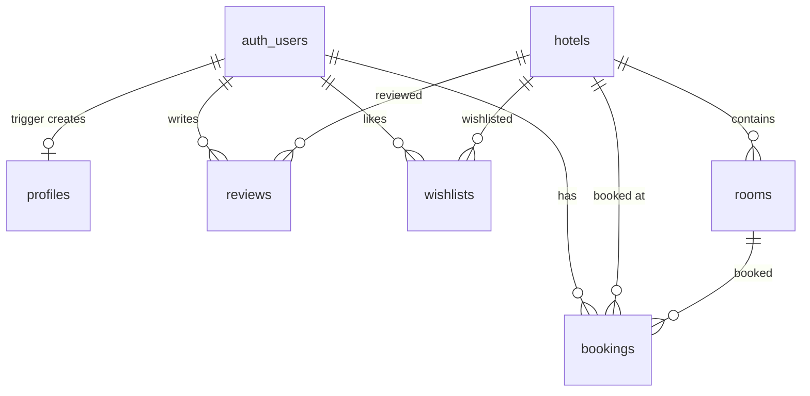

# GrandStay — Complete Interview Prep Guide

> Every answer below is grounded in your **actual codebase**. Code references link to real files.

---

## 🏗️ 1. ARCHITECTURE & DATA FLOW

### How is your code structured (context, hooks, services)?

**3-layer architecture with strict boundaries:**

| Layer | Location | Responsibility |
|---|---|---|
| **Services** | [src/services/](file:///Users/atharvapramodjadhav/Documents/GrandStay-App/src/services) (9 files) | All Supabase calls — query building, error handling, data transformation |
| **Context + Hooks** | [src/context/](file:///Users/atharvapramodjadhav/Documents/GrandStay-App/src/context) (4 providers) + [src/hooks/](file:///Users/atharvapramodjadhav/Documents/GrandStay-App/src/hooks) (9 hooks) | Global state management + reusable behavior |
| **UI** | [src/screens/](file:///Users/atharvapramodjadhav/Documents/GrandStay-App/src/screens) (16) + [src/components/](file:///Users/atharvapramodjadhav/Documents/GrandStay-App/src/components) (37) | Pure presentation |

**The strict rule:** `Screen → Hook → Context/Service → Supabase`. No screen ever imports `supabase` directly.

**4 Contexts nested in order of dependency in** [App.jsx](file:///Users/atharvapramodjadhav/Documents/GrandStay-App/App.jsx):
```
ThemeProvider → AuthProvider → HotelProvider → BookingProvider → AppNavigator
```

- **ThemeProvider** is outermost because colors are needed everywhere (including auth screens).
- **AuthProvider** is 2nd because everything below needs to know who is logged in.
- **HotelProvider** is 3rd because bookings reference hotel/room data.
- **BookingProvider** is innermost because it's only needed inside the main app.

---

### How does data flow from UI to backend?

```
User taps button → Screen calls hook method
  → Hook calls service function
    → Service builds Supabase query & sends to PostgreSQL
      → Response comes back
    → Service transforms snake_case → camelCase
  → Hook updates context/local state
→ React re-renders the screen
```

**Concrete example — loading featured hotels:**
1. `HomeScreen` calls `useHotels().loadFeatured()`
2. `useHotels` hook delegates to `HotelContext.loadFeatured()`
3. `HotelContext` calls `hotelService.fetchFeaturedHotels()`
4. `hotelService` runs `supabase.from('hotels').select('*').eq('is_featured', true)`
5. Result is stored in `HotelContext.featuredHotels` state
6. `HomeScreen` re-renders with the new data

---

### What happens when user clicks "Book Now"?

**5-step progressive flow:**

1. **Hotel Selection** → User picks a hotel → `setSelectedHotel(hotel)` in HotelContext
2. **Room Selection** → [RoomSelectionScreen](file:///Users/atharvapramodjadhav/Documents/GrandStay-App/src/screens/home/RoomSelectionScreen.jsx) → picks room, dates, guests → `BookingContext.setRoomInfo(room)`, `setDraftField('checkIn', date)`
3. **Guest Details** → [BookingScreen](file:///Users/atharvapramodjadhav/Documents/GrandStay-App/src/screens/home/BookingScreen.jsx) → enters name, phone, special requests
4. **Payment** → [PaymentScreen](file:///Users/atharvapramodjadhav/Documents/GrandStay-App/src/screens/home/PaymentScreen.jsx) → selects payment method (Card/UPI/Net Banking/Wallet)
5. **Confirmation** → calls `bookingService.createBooking(draft)` → redirects to [BookingSuccessScreen](file:///Users/atharvapramodjadhav/Documents/GrandStay-App/src/screens/home/BookingSuccessScreen.jsx)

**Under the hood, `createBooking` in** [bookingService.js](file:///Users/atharvapramodjadhav/Documents/GrandStay-App/src/services/bookingService.js):
1. Calls `supabase.rpc('check_availability', ...)` — the PostgreSQL stored procedure
2. If unavailable → throws error → user sees "room no longer available"
3. Generates booking reference (`GS-XXXXXX`)
4. Inserts the booking row with all fields (guest info, price breakdown as JSONB, payment details)
5. Returns `{ id, bookingRef }`

---

### How does your booking system work internally?

The **BookingContext** holds a single `draft` object that accumulates data as the user walks through the 5-step flow:

```js
draft = {
  hotelId, hotelName, hotelImage,   // set in step 1
  roomId, roomType, roomPrice,       // set in step 2
  checkIn, checkOut, nights,         // set in step 2
  guests: { adults, children },      // set in step 2
  guestName, guestPhone,             // set in step 3
  specialRequests, promoCode,        // set in step 3
  priceBreakdown, totalPrice,        // calculated automatically
  paymentMethod, transactionId,      // set in step 4
}
```

Each screen writes to the draft via `setDraftField(key, value)`. This eliminates prop drilling across 5 screens.

---

### How do you prevent double booking?

**Server-side check using a PostgreSQL stored procedure** — [check_availability](file:///Users/atharvapramodjadhav/Documents/GrandStay-App/supabase/schema.sql#L125-L157):

```sql
-- 1. Get total physical rooms for this room type
SELECT quantity INTO v_total_rooms FROM rooms WHERE id = p_room_id;

-- 2. Count overlapping confirmed bookings
SELECT count(*) INTO v_booked_rooms FROM bookings
WHERE hotel_id = p_hotel_id AND room_id = p_room_id
  AND status IN ('confirmed', 'completed')
  AND check_in < p_check_out   -- overlap condition
  AND check_out > p_check_in;

-- 3. Available only if booked < total inventory
RETURN v_booked_rooms < v_total_rooms;
```

**Key points:**
- This runs **atomically on the database server**, not on the client
- Uses the standard date-range overlap formula: `(Start1 < End2) AND (End1 > Start2)`
- The `rooms.quantity` field represents physical inventory (e.g., 5 Deluxe rooms)
- If the RPC returns `false`, the client throws "This room is no longer available"

> [!IMPORTANT]
> **Limitation:** This is NOT fully race-condition-proof. Two users submitting at the exact same instant could both pass the check. A production fix would use `SELECT ... FOR UPDATE` (row-level locking) or a serializable transaction.

---

### How is your data stored in Firestore?

**You actually use Supabase (PostgreSQL), not Firestore.** The `seedFirestore.js` script in your repo is a legacy remnant from an earlier version — you **migrated from Firebase to Supabase** for the relational + PostGIS capabilities.

**6 tables in** [schema.sql](file:///Users/atharvapramodjadhav/Documents/GrandStay-App/supabase/schema.sql):

| Table | Key Columns | Notes |
|---|---|---|
| `profiles` | `id (uuid FK→auth.users)`, name, avatar, phone | Auto-created via trigger on signup |
| `hotels` | `id (text PK)`, name, city, lat/lng, rating, amenities[], images[], `location geography(point)` | PostGIS generated column + GiST index |
| `rooms` | `id (text PK)`, hotel_id (FK), type, price, capacity, quantity | `quantity` = physical inventory count |
| `bookings` | `id (uuid)`, user_id, hotel_id, room_id, `price_breakdown (JSONB)`, status | Full booking lifecycle |
| `reviews` | `id (uuid)`, hotel_id, user_id, rating (1–5 CHECK), text | Rating constraint enforced at DB level |
| `wishlists` | `(user_id, hotel_id) COMPOSITE PK` | Many-to-many join table |

---

### Why did you denormalize some fields?

**Three deliberate denormalizations:**

1. **`bookings.hotel_name` / `bookings.hotel_image` / `bookings.room_type`** — Denormalized from `hotels` and `rooms` tables.
   - **Why:** When a user views their booking history, you need to show hotel name + image. Without denormalization, every booking list query would need a JOIN across 3 tables. With denormalization, `SELECT * FROM bookings WHERE user_id = ?` gives everything needed.
   - **Trade-off:** If a hotel changes its name, old bookings still show the original name. **This is actually correct behavior** — a booking should reflect what the user booked at the time.

2. **`hotels.rating` / `hotels.review_count`** — Denormalized from `reviews` table.
   - **Why:** Showing hotel rating on every card would otherwise require `GROUP BY` + `AVG()` across the reviews table for every hotel. Pre-computed aggregates make hotel list queries O(1) for rating display.
   - **Trade-off:** Must manually update on new review (your `reviewService` does this with an UPDATE after INSERT).

3. **`bookings.price_breakdown` as JSONB** — Stores `{roomRate, nights, subtotal, taxes, discount, total}` as a JSON blob.
   - **Why:** Price breakdown is a snapshot — it preserves the exact calculation at booking time (tax rate might change later). JSONB avoids creating a separate `price_breakdowns` table.

---

## 🗺️ 2. MAP FEATURE (USP)

### How does your map feature work?

[MapScreen.jsx](file:///Users/atharvapramodjadhav/Documents/GrandStay-App/src/screens/map/MapScreen.jsx) uses `react-native-maps` with this flow:

1. On mount → `useLocation()` gets GPS coordinates (or defaults to Mumbai)
2. Map renders at user's location with `initialRegion`
3. Calls `filterByRegion(lat, lng, 15000)` → PostGIS RPC on Supabase
4. Returns hotels within 15km radius → rendered as `<Marker>` components
5. Tap a marker → bottom sheet appears with hotel preview
6. "View Details" → navigates to `HotelDetailsScreen`

**"Search This Area" button:** When user pans the map, `onRegionChangeComplete` captures the new center. Pressing the button calls `filterByRegion()` with the new coordinates.

---

### How do you fetch nearby hotels?

**Server-side via PostGIS** — [get_nearby_hotels](file:///Users/atharvapramodjadhav/Documents/GrandStay-App/supabase/schema.sql#L161-L177):

```sql
SELECT * FROM hotels
WHERE ST_DWithin(
  location,                              -- hotel's geography point
  ST_Point(p_lng, p_lat)::geography,     -- user's position
  p_radius_meters                        -- radius in meters
)
ORDER BY location <-> ST_Point(p_lng, p_lat)::geography;
```

The client just calls `supabase.rpc('get_nearby_hotels', { p_lat, p_lng, p_radius_meters: 15000 })`.

---

### Why can't Firestore do geo queries?

Firestore (and most NoSQL databases) **cannot natively do geospatial radius queries**. Firestore only supports:
- Equality (`==`)
- Range on **one** field (`<`, `>`)
- Array contains

A "find nearby" query needs to compare **two dimensions** (latitude AND longitude) simultaneously against a radius. Firestore would require:
- **Geohash workarounds** — encode lat/lng into a string prefix, query by prefix range. This creates rectangular bounding boxes (not circles), with false positives at corners.
- **Client-side filtering** — fetch ALL hotels, filter in JavaScript. O(n) and wastes bandwidth.

---

### How did you solve that limitation?

**Migrated to Supabase (PostgreSQL + PostGIS):**

1. Added `postgis` extension to the database
2. Hotels table has a **generated column**: `location geography(point) GENERATED ALWAYS AS (ST_Point(lng, lat)::geography) STORED`
3. Created a **GiST spatial index**: `CREATE INDEX hotels_geo_index ON hotels USING gist(location)`
4. Queries use `ST_DWithin()` — true circle radius search, not rectangular approximation
5. Results are **ordered by distance** using the `<->` operator (KNN = K-Nearest-Neighbor)

**This runs in O(log n) on the server** via the spatial index, vs. O(n) client-side filtering.

---

### What happens when user moves the map?

1. `onRegionChangeComplete` fires with the new `region` object (center lat/lng + deltas)
2. Region is saved to state via `handleRegionChange`
3. A **"Search This Area"** button appears (via `SearchAreaButton` component)
4. When pressed → calls `filterByRegion(region.latitude, region.longitude)` → PostGIS query
5. Results replace `visibleHotels` state → markers update

> [!TIP]
> The query is NOT fired automatically on every pan — only when the user explicitly presses "Search This Area". This prevents excessive API calls during panning.

---

### How do you optimize performance for many markers?

Current optimizations:
- **Server-side filtering** — Only hotels within the visible radius are returned (not all 1000+)
- **`useCallback` on handlers** — `handleRegionChange` and `handleSearchArea` are memoized
- **Lazy import of `react-native-maps`** — Uses try/catch to gracefully degrade in Expo Go

**What could be added:**
- **Marker clustering** (e.g., `react-native-map-clustering`) — group nearby markers at low zoom
- **Debounce on region change** — batch rapid pan events
- **Result caching** — avoid re-querying the same area

---

### Edge Cases

**What if location permission is denied?**
[mapService.js](file:///Users/atharvapramodjadhav/Documents/GrandStay-App/src/services/mapService.js#L4-L18) defaults to Mumbai (19.0760, 72.8777). The map still works — user just starts at a default city.

**What if coordinates are invalid?**
The schema uses `double precision` for lat/lng. The `ST_Point()` function will handle edge cases. Markers with `0,0` coordinates (null fallback in MapScreen) would appear off the coast of Africa — a data integrity issue, not a crash.

**What if slow network?**
The RPC call is async. The screen shows `<Loader fullScreen />` while `locLoading` is true. If the PostGIS query fails, the catch block logs a warning and returns an empty array (no markers, but no crash).

---

## ❤️ 3. OFFLINE FEATURE

### How does your offline wishlist work?

**Cache-first, optimistic update pattern** using two services:

[wishlistService.js](file:///Users/atharvapramodjadhav/Documents/GrandStay-App/src/services/wishlistService.js) + [offlineService.js](file:///Users/atharvapramodjadhav/Documents/GrandStay-App/src/services/offlineService.js)

**Read flow (getWishlist):**
1. Immediately return cached data from AsyncStorage (`offlineService.getCache('grandstay_wishlist')`)
2. In the **background** (fire-and-forget), fetch fresh data from Supabase
3. When network response arrives, update the cache for next time

**Write flow (addToWishlist):**
1. **Optimistic cache update** — add the hotel to AsyncStorage immediately
2. Attempt network write to Supabase
3. If network fails → queue the write in `offlineService.queueWrite()`
4. The queue persists in AsyncStorage under `@grandstay_pending_writes`

---

### Where is offline data stored?

**AsyncStorage** (React Native's key-value store, similar to `localStorage` in web):
- Cache: `@grandstay_cache_grandstay_wishlist` → JSON with `{ value: [...hotels], timestamp }`
- Pending writes: `@grandstay_pending_writes` → JSON array of queued operations

---

### How do you sync data when user comes online?

[offlineService.syncPendingWrites](file:///Users/atharvapramodjadhav/Documents/GrandStay-App/src/services/offlineService.js#L66-L84):

```js
for (const op of pendingWrites) {
  try { await executeFn(op); }     // retry each queued write
  catch { failed.push(op); }       // if still fails, keep in queue
}
// Replace queue with only the still-failed operations
```

Each operation has an `_action` field (`'insert'` or `'delete'`) so the executor knows what Supabase call to make.

---

### What happens if user likes a hotel offline?

1. `toggleWishlist(hotel)` is called
2. `wishlistService.addToWishlist()` updates AsyncStorage **immediately** → UI shows the heart as filled
3. The Supabase INSERT fails (no network)
4. The operation is queued: `{ user_id, hotel_id, _action: 'insert', queuedAt: timestamp }`
5. Next time the app opens with network → `syncPendingWrites()` retries the INSERT
6. Unique constraint (`23505` error code) is explicitly ignored — if somehow already synced, no error

---

### How do you handle data inconsistency?

**Potential issues and how they're handled:**

| Scenario | Handling |
|---|---|
| User adds offline, network syncs later | Queue + retry pattern |
| Duplicate insert (already synced) | `23505` unique violation is silently ignored |
| User adds then removes while offline | Both operations queue; on sync, the INSERT then DELETE run sequentially |
| App crash before queue write | Data loss for that single action — AsyncStorage is not transactional |

> [!WARNING]
> **Known limitation:** `useWishlist` hook is local state, not a Context. Two different screens using `useWishlist()` each have their own copy of the wishlist array. They won't share state until the next `loadWishlist()` call.

---

## 🔐 4. AUTHENTICATION

### How does authentication work in your app?

**Supabase Auth (email/password)** via [AuthContext.jsx](file:///Users/atharvapramodjadhav/Documents/GrandStay-App/src/context/AuthContext.jsx):

1. User enters email + password on `LoginScreen`
2. Screen calls `useAuth().login(email, password)`
3. Hook calls `authService.login()` → `supabase.auth.signInWithPassword()`
4. Supabase validates credentials and returns a **JWT session**
5. The `onAuthStateChange` listener in AuthContext fires → calls `fetchAndSetProfile()`
6. Profile is fetched from `profiles` table → `user` state is set
7. `AppNavigator` sees `isAuthenticated = true` → switches from `AuthStack` to `MainTabs`

---

### How does Firebase Auth work internally? (Supabase in your case)

Supabase Auth is built on **PostgreSQL + GoTrue** (an open-source auth server):

1. **Signup** → GoTrue creates a row in `auth.users`, hashes password with bcrypt
2. **Login** → GoTrue verifies bcrypt hash, generates JWT (access + refresh tokens)
3. **Session persistence** → JWT is stored in AsyncStorage (configured in `supabase.js`)
4. **Auto-refresh** → `autoRefreshToken: true` refreshes the access token before expiry
5. **Profile trigger** → A PostgreSQL trigger (`on_auth_user_created`) auto-creates a `profiles` row

---

### What is a JWT token?

**JSON Web Token** — a self-contained, digitally signed token with 3 parts:

```
header.payload.signature
```

- **Header:** `{ "alg": "HS256", "typ": "JWT" }`
- **Payload:** `{ "sub": "user-uuid", "email": "user@email.com", "exp": 1711234567, "role": "authenticated" }`
- **Signature:** `HMAC-SHA256(header.payload, secret_key)`

**Why JWT?** The server doesn't need to store session state. Each request includes the JWT, and the server just verifies the signature. This makes it **stateless and scalable**.

---

### How do you maintain user session?

From [supabase.js](file:///Users/atharvapramodjadhav/Documents/GrandStay-App/src/config/supabase.js):

```js
auth: {
  storage: AsyncStorage,      // JWT persisted in AsyncStorage
  autoRefreshToken: true,      // auto-refresh before expiry
  persistSession: true,        // survive app restarts
  detectSessionInUrl: false,   // not a web app, no URL-based auth
}
```

On app launch → `supabase.auth.getSession()` reads the stored JWT from AsyncStorage. If valid → user is logged in immediately. If expired → auto-refresh kicks in.

---

### What happens after login?

1. `supabase.auth.signInWithPassword()` succeeds → returns `session` with JWT
2. Supabase client stores JWT in AsyncStorage automatically
3. `onAuthStateChange` listener fires with `session.user`
4. `fetchAndSetProfile()` fetches the `profiles` row from PostgreSQL
5. `setUser(profile)` updates React state
6. `AppNavigator` detects `isAuthenticated === true` → renders `MainTabs`
7. User sees the Home screen

---

## 🗄️ 5. DATABASE

### Why did you choose Firestore? (Answer: You chose Supabase/PostgreSQL)

**You chose Supabase (PostgreSQL) over Firestore because:**

1. **PostGIS** — geospatial queries (map feature) are impossible in Firestore without geohash workarounds
2. **Relational queries** — JOINs between hotels/rooms/bookings. Firestore has no JOINs; you'd need multiple round-trips
3. **Stored procedures** — `check_availability()` runs atomically on the server. Firestore would require Cloud Functions
4. **SQL power** — `ORDER BY`, `COUNT()`, `AVG()`, complex filtering all work natively
5. **The migration is proven** — `seedFirestore.js` still exists, showing you had Firestore first and switched without touching any UI code (thanks to the service layer)

---

### Difference between SQL and NoSQL?

| Aspect | SQL (PostgreSQL) | NoSQL (Firestore) |
|---|---|---|
| Schema | Fixed, enforced | Flexible, schema-less |
| Relationships | JOINs between tables | Denormalization / subcollections |
| Queries | Any combination of WHERE, JOIN, GROUP BY | Limited: only indexed fields, no JOINs |
| Transactions | ACID, row-level locking | Limited transactions |
| Scaling | Vertical (bigger server) | Horizontal (auto-sharding) |
| Geo queries | PostGIS extension | Not natively supported |
| Best for | Complex queries, relationships | Simple reads, real-time sync |

**Your app needs JOINs (hotel→rooms→bookings) and geospatial** → SQL was the right choice.

---

### How is your database structured?



---

### What are indexes in Firestore? (Supabase/PostgreSQL version)

In PostgreSQL:
- **B-tree index** (default) — fast lookups on equality and range (`WHERE user_id = ?`)
- **GiST index** — used for spatial data. Your `hotels_geo_index` uses GiST on the `location` column for `ST_DWithin` queries
- **Primary keys** auto-create indexes
- **Foreign keys** should have indexes for JOIN performance

Your schema explicitly creates: `CREATE INDEX hotels_geo_index ON hotels USING gist (location);`

---

### What are Firestore limitations? (Why you switched)

1. No native JOINs — need multiple queries to get hotel + rooms + reviews
2. No geospatial queries — only workarounds with geohashes
3. Limited query operators — no `OR`, no `!=`, no full-text search
4. Composite indexes required for multi-field queries
5. No server-side aggregations (COUNT, AVG) without Cloud Functions
6. No stored procedures — can't do atomic availability checks

---

## ⚙️ 6. FRONTEND (React Native)

### Difference between React and React Native?

| Aspect | React | React Native |
|---|---|---|
| Platform | Web (browser) | Mobile (iOS + Android) |
| Renders to | HTML DOM (`<div>`, `<span>`) | Native views (`<View>`, `<Text>`) |
| Styling | CSS | StyleSheet (JavaScript objects) |
| Navigation | React Router | React Navigation |
| Animations | CSS transitions | react-native-reanimated |

React Native uses the **same component model** (JSX, hooks, state) but targets native mobile views instead of the browser DOM.

---

### What are hooks?

Functions that let you use React features (state, lifecycle, context) inside functional components. They start with `use`.

**Your app uses:**
- `useState` — local state (e.g., `[loading, setLoading]`)
- `useEffect` — side effects (fetch data on mount, subscribe to auth changes)
- `useCallback` — memoize functions to prevent unnecessary re-renders
- `useRef` — mutable refs (map reference, debounce timers)
- `useContext` — read values from React Context

---

### What is useEffect?

Runs side effects after render. Used for:
- **Data fetching** on mount: `useEffect(() => { loadHotels(); }, [])`
- **Subscriptions**: `useEffect(() => { const sub = onAuthChange(...); return () => sub.unsubscribe(); }, [])`
- **Reacting to changes**: `useEffect(() => { filterByRegion(...); }, [region])`

The **dependency array** controls when it re-runs. Empty `[]` = only on mount. `[region]` = whenever `region` changes.

---

### What is useState?

Creates a local state variable and a setter function:
```jsx
const [hotels, setHotels] = useState([]);
```
When `setHotels(newData)` is called, React re-renders the component with the new value. State is **preserved across re-renders** but **lost on unmount**.

---

### What is FlatList and why use it?

`FlatList` = a **virtualized scrolling list**. Only renders items currently visible on screen + a small buffer.

**Why not ScrollView?** ScrollView renders ALL children at once. With 100 hotel cards, it creates 100 views in memory. FlatList renders ~10 visible + recycles views as you scroll = **constant memory**.

Your app uses FlatList in `HomeScreen`, `SearchResultsScreen`, `MyBookingsScreen`, `WishlistScreen`.

---

### What is Context API?

React's built-in dependency injection. Three pieces:
1. `createContext()` — creates a "channel"
2. `<Context.Provider value={...}>` — writes data into the channel
3. `useContext(Context)` — reads data from the nearest Provider

**Your 4 contexts:** `ThemeContext`, `AuthContext`, `HotelContext`, `BookingContext`.

---

### Why use Context instead of props?

Without Context, passing `user` from `App.jsx` to a deeply nested `HotelCard` would require passing it through 5+ intermediate components that don't use it. This is **prop drilling** — messy and fragile.

Context lets any descendant read `user` directly via `useAuth()`.

---

### Difference between Context and Redux?

| Aspect | Context API | Redux |
|---|---|---|
| Built-in | Yes | Separate library |
| Boilerplate | Minimal | Significant (actions, reducers, store) |
| Performance | Re-renders all consumers on change | Fine-grained selectors (`useSelector`) |
| Middleware | None | Thunks, sagas, logging |
| DevTools | None | Redux DevTools (time travel debugging) |
| Best for | Theme, auth, small global state | Large apps with complex state logic |

**Your app uses Context because** you have only 4 isolated state domains. Redux would be overkill.

---

### What are custom hooks?

Functions prefixed `use` that compose built-in hooks. Your 9 custom hooks:
- **Thin wrappers:** `useAuth`, `useTheme` — re-export context for decoupling
- **Context + logic:** `useHotels`, `useBooking`, `useWishlist` — add extra behavior on top of context
- **Standalone:** `useSearch`, `useLocation`, `useReviews`, `useFonts` — own state, no context

**Why?** Components import `useAuth()` instead of `useAuthContext()`. If you switch to Zustand later, only the hook file changes — not 20 screens.

---

## 🔄 7. STATE MANAGEMENT

### How do you manage state in your app?

**3 types of state:**

| Type | Mechanism | Examples |
|---|---|---|
| Global app state | React Context | Theme, auth user, hotels list, booking draft |
| Screen-local state | `useState` | Form inputs, loading flags, selected filters |
| Server cache | Service layer + Context | Hotel data, bookings, reviews |

---

### Why did you use Context API?

1. **Built into React** — zero additional dependencies
2. **4 isolated domains** — each context handles one concern
3. **Simple enough** — no complex state transitions that need reducers
4. **Provider nesting** — naturally models dependency order

---

### What are the limitations of Context?

1. **No `useMemo` on values** — every render creates new objects, causing all consumers to re-render
2. **No fine-grained subscriptions** — if `hotels` changes, components that only use `selectedHotel` also re-render
3. **No built-in caching** — manual loading/error state in every context
4. **No stale-while-revalidate** — always fetches fresh, no background refresh

---

### When would you use Redux or Zustand?

**Redux:** When you need middleware (logging, analytics), time-travel debugging, or complex state transitions (e.g., e-commerce cart with undo).

**Zustand:** When you outgrow Context but don't want Redux's boilerplate. Zustand gives fine-grained selectors, computed state, and persist middleware in ~20 lines.

**TanStack Query:** For server-state specifically (hotels, bookings, reviews). Replaces the entire HotelContext + useHotels pattern with automatic caching, deduplication, and background refetch.

---

## 🌐 8. API & BACKEND CONCEPTS

### What is REST API?

**RE**presentational **S**tate **T**ransfer — an architectural style where:
- Resources are identified by URLs (e.g., `/hotels`, `/bookings/123`)
- HTTP methods define actions: GET (read), POST (create), PUT (update), DELETE (remove)
- Responses are JSON

Supabase auto-generates a REST API from your PostgreSQL tables. When you call `supabase.from('hotels').select('*')`, it becomes `GET /rest/v1/hotels` under the hood.

---

### What is JSON?

**J**ava**S**cript **O**bject **N**otation — a lightweight data format. All API communication in your app uses JSON. Example:

```json
{ "hotelId": "h1", "name": "Taj Palace", "rating": 4.5, "amenities": ["WiFi", "Pool"] }
```

Your `price_breakdown` column is stored as JSONB (binary JSON) in PostgreSQL for flexible schema.

---

### What is latency?

The time between sending a request and receiving the first byte of response. In your app:
- **Supabase API call** ≈ 50–200ms (depends on region)
- **PostGIS spatial query** ≈ 5–50ms (indexed, very fast)
- **AsyncStorage read** ≈ 1–5ms (local, instant)

Your wishlist's cache-first pattern reduces perceived latency to near-zero by showing cached data while the network request runs.

---

### What is caching?

Storing data closer to the consumer to avoid repeated expensive fetches. Your app has two cache layers:

1. **AsyncStorage cache** (offlineService) — persists wishlist, theme preference, language
2. **React state cache** (Context) — hotels, user profile stay in memory until app closes

---

## ⚡ 9. PERFORMANCE

### How do you optimize app performance?

| Optimization | Where | Impact |
|---|---|---|
| FlatList virtualization | Hotel lists, bookings | Constant memory regardless of list size |
| `useCallback` on handlers | All hooks and screens | Prevents child re-renders from changed references |
| Server-side filtering | PostGIS, search, bookings | Only transfer needed data, not entire tables |
| Cache-first reads | Wishlist, theme | Instant UI, network in background |
| Lazy map import | MapScreen | Try-catch import of react-native-maps for Expo Go graceful degradation |
| 300ms search debounce | useSearch hook | Prevents query on every keystroke |

---

### How do you handle large data?

- **Pagination** — `appConfig.js` has pagination settings (items per page)
- **FlatList** — virtualized rendering
- **Server-side search** — `searchService` sends filters to Supabase, not filtering locally
- **PostGIS spatial index** — O(log n) for geo queries

---

### How do you reduce re-renders?

- `useCallback` on all handler functions
- Separate contexts for separate concerns (theme change doesn't re-render hotel list)
- Hook abstraction layer (screens don't directly consume context)

> [!NOTE]
> **Known issue:** Context `value` objects are not wrapped in `useMemo`. This means every provider re-render creates a new object, causing all consumers to re-render. Adding `useMemo` to all 4 providers would be the highest-impact performance fix.

---

## 🔒 10. SECURITY

### How do you secure your app?

1. **Supabase Auth** — passwords never stored in app, bcrypt hashing on server
2. **JWT tokens** — stateless auth, short-lived access tokens with auto-refresh
3. **Environment variables** — Supabase URL and anon key in `.env`, not hardcoded
4. **Input validation** — Luhn algorithm for card numbers, email/phone regex, password strength
5. **Server-side checks** — Availability check runs on PostgreSQL, not client

**Missing (MVPtrade-offs):**
- RLS (Row Level Security) is **not enabled** — any authenticated user could theoretically read/write other users' data
- No rate limiting on API calls
- Payment is mock (no real PCI compliance)

---

### Difference between public key and private key?

- **Public key (anon key)** — safe to expose in client code. It identifies your Supabase project. It only grants access that RLS policies allow.
- **Private key (service role key)** — **NEVER** expose. Bypasses all RLS. Used only on server-side (Cloud Functions, backend).

Your app uses the `EXPO_PUBLIC_SUPABASE_ANON_KEY` (public). The `EXPO_PUBLIC_` prefix means it's bundled into the app — this is safe because Supabase designed the anon key for client-side use (with RLS enforced).

---

## 📦 11. MOBILE APP SPECIFIC

### Difference between Expo and React Native CLI?

| Aspect | Expo (Managed) | React Native CLI |
|---|---|---|
| Setup | `npx create-expo-app` | `npx react-native init` |
| Build | EAS Cloud builds | Local Xcode/Android Studio |
| Native code | Managed by Expo team | Full control |
| OTA updates | Expo Updates built-in | Code Push or custom |
| Limitations | Some native modules unavailable | Anything goes |

---

### Why did you choose Expo?

1. **Rapid development** — no Xcode/Android Studio needed for most features
2. **EAS Build** — cloud builds for APK/AAB without local native toolchain
3. **Expo SDK** — pre-packaged expo-location, expo-font, expo-localization
4. **Development builds** — when you need native modules (react-native-maps), dev builds bridge the gap

---

### Limitations of Expo?

1. Some native modules not available in Expo Go (e.g., `react-native-maps` — your code has a try-catch fallback for this)
2. Larger bundle size (Expo runtime included)
3. Less control over native build configuration
4. Some advanced native integrations (Bluetooth, NFC) require ejecting

---

### What is APK vs AAB?

- **APK** (Android Package) — self-contained installable file. Used for testing/distribution outside Play Store
- **AAB** (Android App Bundle) — Play Store optimized format. Google generates device-specific APKs, reducing download size by ~15%

Your `eas.json` has a `preview` profile that builds APK (for testing) and `production` that would use AAB.

---

## 🧠 12. EDGE CASE / THINKING QUESTIONS

### What will break in your system first?

**Context re-renders.** Without `useMemo` on Provider values, every state change in `AuthContext` re-renders every component that uses `useAuth()` — including every `HotelCard` that checks auth for wishlist. At scale (100+ cards), this causes frame drops.

### What is the weakest part of your app?

**The wishlist hook being local state, not a shared Context.** Two screens showing the same hotel's wishlist status can be out of sync. And the double-booking prevention lacks row-level locking.

### If your app crashes, how will you debug?

1. **ErrorBoundary** component catches React render errors and shows a fallback UI
2. `errorMessages.js` maps Supabase error codes to readable messages
3. Console logs throughout services for development
4. **For production:** Would add Sentry for crash reporting, structured logging

### What would you improve if given 1 week?

1. Add `useMemo` to all 4 Context Providers (1 hour, highest impact)
2. Promote Wishlist to a Context or Zustand store (4 hours)
3. Enable Supabase RLS policies (4 hours)
4. Add TanStack Query for server state (replaces HotelContext entirely) (1 day)
5. Add marker clustering to MapScreen (4 hours)
6. Implement real-time booking updates via Supabase Realtime (1 day)

### How would you improve user experience?

1. Skeleton loaders instead of spinners (already have `SkeletonCard` component, could use more)
2. Pull-to-refresh on hotel/booking lists
3. Deep linking — share a hotel URL that opens directly in the app
4. Booking reminders via push notifications

### What feature would you add next?

**Reviews with photos** — Let users upload images with their reviews. Use Supabase Storage for image uploads. This adds social proof and would increase booking conversions.

### How would you monetize this app?

1. **Commission model** — charge hotels a % per booking
2. **Featured listings** — hotels pay to be in the "Featured" section
3. **Premium filters** — advanced search as a paid feature
4. **Affiliate deals** — commission from partner services (flights, cabs)

---

## 💣 13. PROJECT-SPECIFIC QUESTIONS

### How does your map filtering work?

1. User's GPS position → `useLocation()` hook
2. Center coordinates sent to `filterByRegion(lat, lng, 15000)`
3. Calls `supabase.rpc('get_nearby_hotels', ...)` → PostGIS `ST_DWithin` query
4. Returns hotels within 15km as JSON
5. Hotels rendered as `<Marker>` on `react-native-maps`
6. User pans → "Search This Area" button → re-queries with new center

---

### How do you store hotel data?

**PostgreSQL table `hotels`** with:
- Standard fields: name, city, address, description, price, rating
- Arrays: `images text[]`, `amenities text[]`
- Spatial: `lat`, `lng` → `location geography(point) GENERATED ALWAYS AS (ST_Point(lng, lat)::geography) STORED`
- GiST index on `location` for O(log n) spatial queries
- `is_featured boolean` for the featured section

Rooms are separate table (`rooms`) linked by `hotel_id` FK, with their own pricing, capacity, and inventory quantity.

---

### How does booking flow work step-by-step?

1. **Browse** → User sees hotel on HomeScreen/MapScreen
2. **Select Hotel** → navigates to `HotelDetailsScreen` → views images, amenities, reviews
3. **Select Room** → `RoomSelectionScreen` → picks room type, dates, number of guests
   - `BookingContext.setRoomInfo(room)`, `setDraftField('checkIn', date)`
4. **Guest Details** → `BookingScreen` → enters name, phone, applies promo code
   - `calculatePrice()` computes subtotal + 18% GST + discount
5. **Payment** → `PaymentScreen` → card/UPI/net banking/wallet
   - Card validated with Luhn algorithm
   - Mock payment processed with simulated delay
6. **Server-side** → `bookingService.createBooking()`:
   - RPC `check_availability()` → atomic inventory check
   - INSERT into `bookings` table
   - Returns booking reference `GS-XXXXXX`
7. **Success** → `BookingSuccessScreen` → Lottie animation, booking ref displayed

---

### How do you handle offline wishlist?

(See Section 3 above for full details)

**TL;DR:** Cache-first reads from AsyncStorage, optimistic local updates, network writes queued on failure, pending writes retried on reconnect.

---

### Why did you structure your app this way?

1. **Service layer** → backend-agnostic (proven by Firebase→Supabase migration)
2. **Context for core state** → theme and auth are perfect Context use cases
3. **Hooks as API** → decouples screens from state management library choice
4. **PostGIS** → the map feature needed real geospatial queries
5. **Progressive booking draft** → multi-step wizard without prop drilling
6. **i18n from day one** → India-focused app needs multi-language support

---

## 📈 SCALABILITY

### What happens if you have 1 million users?

**Current bottlenecks:**

| Component | Issue | Solution |
|---|---|---|
| Supabase free tier | Connection pool limit (~30) | Upgrade to Pro plan + connection pooling (PgBouncer) |
| Context re-renders | Every auth change re-renders everything | Add `useMemo`, switch server-state to TanStack Query |
| `check_availability` | Not race-condition safe | Add `SELECT ... FOR UPDATE` row locking |
| Single Supabase instance | Latency for global users | Multi-region read replicas |
| Mock payments | Not production-ready | Integrate Razorpay/Stripe |

### How would you scale this system?

1. **Database** → Enable connection pooling, add read replicas, partition bookings by date
2. **Caching** → Add Redis between app and DB for hotel/search results
3. **CDN** → Hotel images served from Supabase Storage CDN
4. **State management** → Switch to TanStack Query for automatic deduplication and caching
5. **Search** → Move from `ILIKE` text search to Elasticsearch/Typesense
6. **Background jobs** → Move email confirmations, booking reminders to serverless functions

### When would you switch from Firebase to custom backend?

**You already did switch** (Firebase → Supabase). But to go further:

Switch to a **custom backend (Node.js/Go + PostgreSQL)** when you need:
1. Complex business logic (revenue calculation, loyalty programs)
2. Third-party integrations (payment gateways, channel managers)
3. Custom authentication flows (OTP, social login with custom logic)
4. WebSocket-based real-time features beyond Supabase Realtime
5. Fine-grained rate limiting and abuse prevention
6. Cost optimization at scale (self-hosted DB is cheaper than Supabase at millions of rows)
