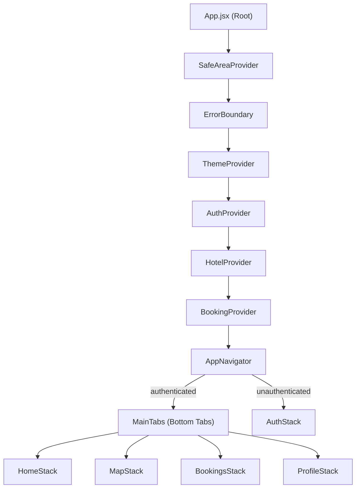

# GrandStay (अतिथि) — Project Summary

A **React Native (Expo)** hotel-booking mobile app targeting the Indian market. Users can browse, search, and book hotel rooms with a full booking flow, map-based discovery, wishlists, reviews, dark mode, and multi-language support. The backend is **Supabase** (PostgreSQL + PostGIS + Auth).

---

## Tech Stack

| Layer | Technology |
|---|---|
| Framework | React Native 0.81 + Expo SDK 54 |
| Navigation | React Navigation 7 (Stack + Bottom Tabs) |
| Backend / DB | Supabase (PostgreSQL, PostGIS, Auth, REST) |
| State Mgmt | React Context API (4 providers) |
| i18n | i18next + react-i18next (6 languages) |
| Maps | react-native-maps + PostGIS spatial queries |
| Animations | react-native-reanimated, Lottie |
| Fonts | Google Fonts (Inter family via `@expo-google-fonts`) |
| Offline | AsyncStorage-based caching + write queue |
| Build | EAS Build (dev, preview APK, production) |

---

## Architecture Overview

The app uses a **provider-wrapped root** pattern — each Context wraps the tree so every screen can access auth, theme, hotel, and booking state. `AppNavigator` conditionally renders `AuthStack` or `MainTabs` based on auth status.

---

## File-by-File Breakdown

### Root Files

| File | Purpose |
|---|---|
| [App.jsx](file:///Users/atharvapramodjadhav/Documents/GrandStay-App/App.jsx) | Entry point — loads fonts, manages splash screen, wraps entire app in nested Context providers |
| [index.js](file:///Users/atharvapramodjadhav/Documents/GrandStay-App/index.js) | Expo entry point — calls `registerRootComponent(App)` |
| [app.json](file:///Users/atharvapramodjadhav/Documents/GrandStay-App/app.json) | Expo config — app name "अतिथि", icons, splash, plugins (expo-font, expo-localization) |
| [package.json](file:///Users/atharvapramodjadhav/Documents/GrandStay-App/package.json) | Dependencies and npm scripts (`start`, `android`, `ios`, `web`) |
| [eas.json](file:///Users/atharvapramodjadhav/Documents/GrandStay-App/eas.json) | EAS Build profiles: dev (internal), preview (APK), production |
| [.env.example](file:///Users/atharvapramodjadhav/Documents/GrandStay-App/.env.example) | Template for `EXPO_PUBLIC_SUPABASE_URL` and `EXPO_PUBLIC_SUPABASE_ANON_KEY` |

---

### `src/config/` — Configuration

| File | Purpose |
|---|---|
| [supabase.js](file:///Users/atharvapramodjadhav/Documents/GrandStay-App/src/config/supabase.js) | Initializes the Supabase client with env vars, AsyncStorage for session persistence |
| [appConfig.js](file:///Users/atharvapramodjadhav/Documents/GrandStay-App/src/config/appConfig.js) | Central app constants: default city (Mumbai), tax rate (18% GST), promo codes, currency list, pagination settings |

---

### `src/context/` — State Management (React Context)

| File | Purpose |
|---|---|
| [AuthContext.jsx](file:///Users/atharvapramodjadhav/Documents/GrandStay-App/src/context/AuthContext.jsx) | Manages user session via Supabase Auth; provides `login`, `signup`, `logout`, `updateUser`; listens for auth state changes |
| [HotelContext.jsx](file:///Users/atharvapramodjadhav/Documents/GrandStay-App/src/context/HotelContext.jsx) | Global hotel state: all hotels, featured, nearby; methods to load each category + select/deselect hotels |
| [BookingContext.jsx](file:///Users/atharvapramodjadhav/Documents/GrandStay-App/src/context/BookingContext.jsx) | Booking "draft" state — accumulates hotel, room, dates, guests, pricing, and payment info as the user progresses through the booking flow |
| [ThemeContext.jsx](file:///Users/atharvapramodjadhav/Documents/GrandStay-App/src/context/ThemeContext.jsx) | Light/dark theme toggle with AsyncStorage persistence; exposes `colors`, `isDark`, `toggleTheme` |

---

### `src/navigation/` — Navigation Architecture

| File | Purpose |
|---|---|
| [AppNavigator.jsx](file:///Users/atharvapramodjadhav/Documents/GrandStay-App/src/navigation/AppNavigator.jsx) | Root navigator — switches between `AuthStack` and `MainTabs` based on auth state |
| [AuthStack.jsx](file:///Users/atharvapramodjadhav/Documents/GrandStay-App/src/navigation/AuthStack.jsx) | Stack: Splash → Login → Signup |
| [MainTabs.jsx](file:///Users/atharvapramodjadhav/Documents/GrandStay-App/src/navigation/MainTabs.jsx) | Bottom tab bar with 4 tabs: Home, Map, Bookings, Profile (Ionicons, themed) |
| [HomeStack.jsx](file:///Users/atharvapramodjadhav/Documents/GrandStay-App/src/navigation/HomeStack.jsx) | Stack: Home → SearchResults → HotelDetails → RoomSelection → Booking → Payment → BookingSuccess |
| [MapStack.jsx](file:///Users/atharvapramodjadhav/Documents/GrandStay-App/src/navigation/MapStack.jsx) | Stack: MapScreen → HotelDetails |
| [BookingsStack.jsx](file:///Users/atharvapramodjadhav/Documents/GrandStay-App/src/navigation/BookingsStack.jsx) | Stack: MyBookings → BookingDetails |
| [ProfileStack.jsx](file:///Users/atharvapramodjadhav/Documents/GrandStay-App/src/navigation/ProfileStack.jsx) | Stack: Profile → Settings, Wishlist |

---

### `src/screens/` — 16 Screens

#### Auth (`screens/auth/`)
| Screen | Purpose |
|---|---|
| `SplashScreen.jsx` | Animated splash with Lottie, auto-navigates to Login |
| `LoginScreen.jsx` | Email/password login form with validation |
| `SignupScreen.jsx` | Registration with name, email, password + password strength meter |

#### Home (`screens/home/`)
| Screen | Purpose |
|---|---|
| `HomeScreen.jsx` | Main landing — greeting, search bar, category filter, promo banner, featured hotels |
| `SearchResultsScreen.jsx` | Filtered hotel list with sort/filter options (category, rating, amenities) |
| `HotelDetailsScreen.jsx` | Full hotel page — image carousel, amenities grid, reviews, ratings, wishlist toggle |
| `RoomSelectionScreen.jsx` | List of available rooms with date/guest picker |
| `BookingScreen.jsx` | Guest details form + booking summary |
| `PaymentScreen.jsx` | Payment method selection (Card/UPI/Net Banking/Wallet) + card input form |
| `BookingSuccessScreen.jsx` | Confirmation with booking reference, Lottie animation |

#### Bookings (`screens/bookings/`)
| Screen | Purpose |
|---|---|
| `MyBookingsScreen.jsx` | List of user's bookings with status tabs (Upcoming/Completed/Cancelled) |
| `BookingDetailsScreen.jsx` | Full booking details with cancel function |

#### Map (`screens/map/`)
| Screen | Purpose |
|---|---|
| `MapScreen.jsx` | Interactive map with hotel markers, bottom sheet preview, "Search This Area" button |

#### Profile (`screens/profile/`)
| Screen | Purpose |
|---|---|
| `ProfileScreen.jsx` | User profile, avatar, booking stats, navigation to settings/wishlist |
| `SettingsScreen.jsx` | Theme toggle, language selector, currency, account management |
| `WishlistScreen.jsx` | Saved hotels list |

---

### `src/components/` — 37 Reusable Components

#### `components/common/` (13) — Design System
`Avatar`, `Badge`, `Button`, `Card`, `Divider`, `EmptyState`, `ErrorBoundary`, `Input`, `Loader`, `Modal`, `ProgressSteps`, `ScreenWrapper`, `SkeletonCard`, `Toast`

#### `components/hotel/` (11) — Hotel UI
`AmenitiesGrid`, `AmenityIcon`, `HotelCard`, `HotelCardHorizontal`, `HotelMarker`, `HotelPreviewCard`, `ImageCarousel`, `RatingBreakdown`, `ReviewCard`, `RoomCard`

#### `components/booking/` (8) — Booking Flow
`BookingSummaryCard`, `CancellationPolicy`, `CardInputForm`, `DateRangePicker`, `GuestPicker`, `PaymentMethodCard`, `PriceBreakdown`, `PromoCodeInput`

#### `components/home/` (3) — Home Page
`CategoryFilter`, `PromoBanner`, `SearchBar`

#### `components/map/` (2) — Map
`MapBottomSheet`, `SearchAreaButton`

---

### `src/services/` — 9 Service Modules (Data Layer)

| File | Purpose |
|---|---|
| [authService.js](file:///Users/atharvapramodjadhav/Documents/GrandStay-App/src/services/authService.js) | Supabase Auth wrapper: login, signup, logout, resetPassword, profile CRUD |
| [hotelService.js](file:///Users/atharvapramodjadhav/Documents/GrandStay-App/src/services/hotelService.js) | Fetch all/featured/by-ID hotels and rooms from `hotels`/`rooms` tables |
| [bookingService.js](file:///Users/atharvapramodjadhav/Documents/GrandStay-App/src/services/bookingService.js) | Full CRUD: create (with availability RPC check), list, get by ID, cancel; price calculation + promo codes |
| [searchService.js](file:///Users/atharvapramodjadhav/Documents/GrandStay-App/src/services/searchService.js) | Server-side search with `ilike` text matching, category filter, amenity contains, sort options |
| [mapService.js](file:///Users/atharvapramodjadhav/Documents/GrandStay-App/src/services/mapService.js) | Location permissions via expo-location, PostGIS `get_nearby_hotels` RPC, Haversine distance calc |
| [reviewService.js](file:///Users/atharvapramodjadhav/Documents/GrandStay-App/src/services/reviewService.js) | Fetch/add reviews + recalculate hotel average rating on submission |
| [wishlistService.js](file:///Users/atharvapramodjadhav/Documents/GrandStay-App/src/services/wishlistService.js) | Optimistic cache-first wishlist with offline queuing for add/remove |
| [paymentService.js](file:///Users/atharvapramodjadhav/Documents/GrandStay-App/src/services/paymentService.js) | Mock payment processor (simulated delay), card validation (Luhn algorithm), payment method list |
| [offlineService.js](file:///Users/atharvapramodjadhav/Documents/GrandStay-App/src/services/offlineService.js) | AsyncStorage cache layer + pending write queue with sync-on-reconnect pattern |

---

### `src/hooks/` — 9 Custom Hooks

| Hook | Purpose |
|---|---|
| `useAuth.js` | Shortcut to `useAuthContext()` |
| `useTheme.js` | Shortcut to `useThemeContext()` |
| `useHotels.js` | Wraps HotelContext with auto-load on mount |
| `useBooking.js` | Wraps BookingContext for booking flow |
| `useSearch.js` | Debounced search with filter state management |
| `useLocation.js` | GPS location hook using expo-location |
| `useReviews.js` | Loads and submits reviews for a hotel |
| `useWishlist.js` | Wishlist state with optimistic UI toggle |
| `useFonts.js` | Loads Inter font family variants |

---

### `src/utils/` — 6 Utility Modules

| File | Purpose |
|---|---|
| [constants.js](file:///Users/atharvapramodjadhav/Documents/GrandStay-App/src/utils/constants.js) | Design tokens (colors, spacing, font sizes, border radii, shadows), amenity/category/payment enums |
| [theme.js](file:///Users/atharvapramodjadhav/Documents/GrandStay-App/src/utils/theme.js) | Light & dark theme color definitions using constants |
| [formatters.js](file:///Users/atharvapramodjadhav/Documents/GrandStay-App/src/utils/formatters.js) | Price (INR/USD/EUR/GBP), date, distance, rating, card number formatters |
| [validators.js](file:///Users/atharvapramodjadhav/Documents/GrandStay-App/src/utils/validators.js) | Email, password (with strength scoring), phone, card (Luhn), expiry, CVV, UPI validators |
| [helpers.js](file:///Users/atharvapramodjadhav/Documents/GrandStay-App/src/utils/helpers.js) | Night calculation, distance calc, ID generators, debounce, text truncation |
| [errorMessages.js](file:///Users/atharvapramodjadhav/Documents/GrandStay-App/src/utils/errorMessages.js) | Maps Supabase/Postgres error codes to user-friendly messages |

---

### `src/i18n/` — Internationalization

| File | Purpose |
|---|---|
| [index.js](file:///Users/atharvapramodjadhav/Documents/GrandStay-App/src/i18n/index.js) | i18next config with custom AsyncStorage language detector + device locale fallback |
| `locales/en.json` | English translations |
| `locales/hi.json` | Hindi (हिंदी) |
| `locales/ta.json` | Tamil (தமிழ்) |
| `locales/te.json` | Telugu (తెలుగు) |
| `locales/kn.json` | Kannada (ಕನ್ನಡ) |
| `locales/bn.json` | Bengali (বাংলা) |

---

### `supabase/schema.sql` — Database Schema

6 tables with PostGIS and stored procedures:

| Table | Purpose |
|---|---|
| `profiles` | Extends Supabase Auth users (name, avatar, phone); auto-created via trigger |
| `hotels` | Hotel listings with PostGIS `geography(point)` generated column + spatial index |
| `rooms` | Room types per hotel with pricing, capacity, features, inventory quantity |
| `bookings` | Full booking records with guest info, price breakdown (JSONB), status lifecycle |
| `reviews` | User reviews with 1–5 rating constraint |
| `wishlists` | User ↔ Hotel many-to-many (composite primary key) |

**RPC Functions:**
- `check_availability()` — overlapping booking count vs. room inventory
- `get_nearby_hotels()` — PostGIS `ST_DWithin` spatial radius query

---

### `scripts/` — Seed & Utility Scripts

| File | Purpose |
|---|---|
| `seedSupabase.js` | Seeds hotels, rooms, and reviews into Supabase |
| `seedFirestore.js` | Legacy Firestore seeder (from earlier version) |
| `seedFlood.js` | Bulk data seeder for load testing |
| `addWalletBalance.js` | Utility to add wallet balance to user profiles |

---

## Architecture Choices Explained

### 1. **Expo Managed Workflow**
Chosen for rapid cross-platform development (iOS + Android) without native build toolchain complexity. EAS Build handles native builds when needed (e.g., `react-native-maps`). This eliminates the need to manage Xcode/Android Studio directly.

### 2. **Supabase over Firebase**
Supabase provides a real PostgreSQL database (vs. Firestore's NoSQL), enabling relational queries, joins, and — crucially — **PostGIS** for geospatial hotel search. Row Level Security (RLS) is architecturally supported but not enforced in this MVP. The presence of `seedFirestore.js` suggests the project **migrated from Firebase to Supabase**.

### 3. **PostGIS for Map-Based Discovery**
Rather than filtering hotels by distance on the client (expensive with large datasets), the app pushes spatial queries to PostgreSQL using `ST_DWithin`. Hotels have a generated `geography(point)` column with a GiST index — queries like "find hotels within 15 km" run in milliseconds server-side.

### 4. **React Context over Redux/Zustand**
With only 4 domain contexts (Auth, Theme, Hotel, Booking), React Context is sufficient and avoids extra dependencies. Each context is isolated, preventing unnecessary re-renders across unrelated state changes.

### 5. **Service Layer Pattern**
All Supabase calls are isolated in `src/services/`. Screens and hooks never call Supabase directly — they go through services that handle query building, error mapping, and snake_case → camelCase transformation. This creates a clean API boundary and makes backend swaps feasible.

### 6. **Offline-First Wishlist with Write Queue**
`wishlistService.js` uses an optimistic, cache-first pattern: the UI updates immediately from AsyncStorage, while network writes happen in the background. Failed writes are queued in `offlineService.js` and retried later — a pragmatic offline-first approach without a full sync engine.

### 7. **Booking Draft as Progressive State**
`BookingContext` holds a mutable "draft" object that accumulates data as the user moves through the multi-step booking flow (hotel → room → dates → guests → payment). This avoids prop-drilling across 5 screens and keeps the flow state centralized.

### 8. **Multi-Language (i18n) with Indian Focus**
6 languages (English + 5 Indian: Hindi, Tamil, Telugu, Kannada, Bengali) with a language detector that checks AsyncStorage → device locale → fallback to English. This is purpose-built for an India-focused hospitality app.

### 9. **Design Token System**
`constants.js` defines a full set of design tokens (colors, spacing, font sizes, shadows, border radii) used by both `theme.js` and all components. This ensures visual consistency and makes theme switching (light ↔ dark) a single-reference-point change.

### 10. **Mock Payment Gateway**
`paymentService.js` simulates payment processing with a configurable delay. Card validation uses the real Luhn algorithm, but transactions always succeed — appropriate for MVP/demo while the UX is production-realistic.
